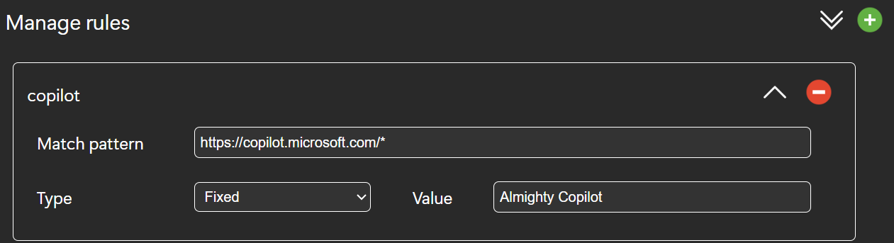
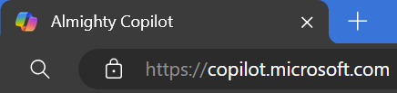

<table align="center" border="0">
    <tr>
        <td></td>
        <td><h3>Ruliname - Automatically Rename Browser Tab Titles</h3></td>
    </tr>
</table>

 

Install Ruliname: <a href="todo">Microsoft Edge</a> | <a href="todo">Google Chrome</a>
  

Ruliname: a powerful browser extension that lets you define URL-based rules to automatically rename your browser tabs. Simplify and organize your browsing experience with customizable tab titles that match your workflow and preferences. Say goodbye to cluttered tab bars and hello to efficiency with Ruliname.

## Getting Started

Once installed, setup is simple. Click the extension icon and browse to the extension options page.
In the options page, either import previously exported configurations, or add rules using the editor.

A rule is composed of:
- Match pattern - a Regex string that applies to pages URLs. When the browser tab is accessing a URL, the extension will try to match the URL with the match patterns. If there is a match, the automatic rename will take place.
For more information on how to construct a match pattern, [click here](https://developer.mozilla.org/en-US/docs/Mozilla/Add-ons/WebExtensions/Match_patterns).
- Type - choose what kind of value will be used to perform the rename operation. The supported types are:
  - Fixed - the tab's title will be renamed to a fixed title.
  - Element ID - the extension will read the value of the provided HTML element ID, and use it to perform the rename operation.
  - Class ID - the extension will read the value of the first HTML element in the page that has a class ID matching the provided class ID, and use it to perform the rename operation.
- Value - the value that will be used while performing the rename operation.

## Examples

The following rule setup, will cause any Microsoft Copilot tab's title to be renamed to "Almighty Copilot"

Result:

## Compatibility

The extension has been developed for Chromium, and is compatible with Microsoft Edge and Google Chrome browsers that support chromium version 96 and above.

## Bug Report or Feature Suggestion

In case a bug is found, or a feature is requested, please create a new issue with the relevant details.

## Developer guide

The extension is developed in Javascript and uses npm to build and pack the extension before publishing.

To set up a workspace, follow these steps:

1. Clone the repository locally
2. ``cd`` to the repository
3. Run ``npm install`` - this will install dependency libraries.
4. Run ``npm run build`` - build the extension. The artifacts will be ready in ``/dist`` folder.
5. To test the extension, use 'Developer mode' in your browser extensions tab, and load the ``/dist`` folder as an unpacked extension.
6. Optional: ``npm run watch`` - automatically listen to changes in the file system and rebuild the extension. Note - this does not automatically reloads the extension.
7. Run ``npm run lint`` - runs ESLint to check for detectable errors.
8. Run ``npm run test`` - runs unit tests and prints the output. This project uses ``Mocha`` as testing framework.
9. Run ``npm run pack`` - packs the extension after build. This will produce a zip file ready to be published.

## MIT License

Copyright (c) 2024 ohadvano

Permission is hereby granted, free of charge, to any person obtaining a copy
of this software and associated documentation files (the "Software"), to deal
in the Software without restriction, including without limitation the rights
to use, copy, modify, merge, publish, distribute, sublicense, and/or sell
copies of the Software, and to permit persons to whom the Software is
furnished to do so, subject to the following conditions:

The above copyright notice and this permission notice shall be included in all
copies or substantial portions of the Software.

THE SOFTWARE IS PROVIDED "AS IS", WITHOUT WARRANTY OF ANY KIND, EXPRESS OR
IMPLIED, INCLUDING BUT NOT LIMITED TO THE WARRANTIES OF MERCHANTABILITY,
FITNESS FOR A PARTICULAR PURPOSE AND NONINFRINGEMENT. IN NO EVENT SHALL THE
AUTHORS OR COPYRIGHT HOLDERS BE LIABLE FOR ANY CLAIM, DAMAGES OR OTHER
LIABILITY, WHETHER IN AN ACTION OF CONTRACT, TORT OR OTHERWISE, ARISING FROM,
OUT OF OR IN CONNECTION WITH THE SOFTWARE OR THE USE OR OTHER DEALINGS IN THE
SOFTWARE.
